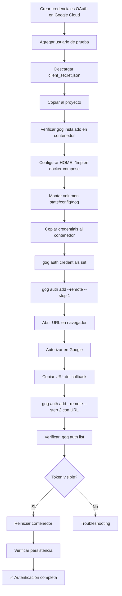

# Guía Completa de Autenticación de gog en Docker

## 📋 Tabla de Contenidos

1. [Resumen del Problema](#resumen-del-problema)
2. [Requisitos Previos](#requisitos-previos)
3. [Paso 1: Crear Credenciales OAuth en Google Cloud](#paso-1-crear-credenciales-oauth-en-google-cloud)
4. [Paso 2: Verificar Instalación de gog](#paso-2-verificar-instalación-de-gog)
5. [Paso 3: Autenticación Manual (Método Probado)](#paso-3-autenticación-manual-método-probado)
6. [Paso 4: Verificación](#paso-4-verificación)
7. [Troubleshooting](#troubleshooting)
8. [Comandos Útiles](#comandos-útiles)

---

## Resumen del Problema

**Problema:** `gog` (Google OAuth Gateway CLI) necesita autenticarse con Google Workspace, pero al correr dentro de un contenedor Docker en Windows, hay varios desafíos:

1. Los tokens OAuth se almacenan en un keyring que es diferente entre Windows y Linux
2. El callback OAuth no puede llegar al servidor dentro del contenedor
3. Los volúmenes montados desde Windows pueden ser de solo lectura
4. PowerShell corta comandos largos al pegarlos

**Solución:** Usar autenticación remota en 2 pasos con `--remote` y almacenar tokens en `/tmp` dentro del contenedor con volumen persistente.

---

## Requisitos Previos

### 1. Google Cloud Console Setup

✅ Proyecto de Google Cloud creado
✅ APIs habilitadas:
- Gmail API
- Google Calendar API
- Google Drive API
- Google Docs API
- Google Sheets API
- People API (Contacts)

✅ Pantalla de consentimiento OAuth configurada (modo Externo)
✅ Usuario de prueba agregado (tu email)
✅ Credenciales OAuth 2.0 descargadas (`client_secret_*.json`)

### 2. Docker Setup

✅ Docker Desktop instalado y corriendo
✅ docker-compose funcional
✅ Contenedor OpenClaw construido con `gog` instalado

### 3. Archivos del Proyecto

```
regiclaw-corregido/
├── client_secret_*.json          # Credenciales OAuth de Google
├── docker-compose.yml             # Configurado con HOME=/tmp
├── Dockerfile.regina              # Incluye instalación de gog
└── state/
    └── config/
        └── gog/                   # Volumen para persistencia de tokens
```

---

## Paso 1: Crear Credenciales OAuth en Google Cloud

### 1.1. Acceder a Google Cloud Console

1. Ve a https://console.cloud.google.com/
2. Inicia sesión con tu cuenta de Google

### 1.2. Crear o Seleccionar Proyecto

1. Click en selector de proyectos (arriba)
2. **"Nuevo Proyecto"** o selecciona uno existente
3. Nombre: `Regina Assistant` (o el que prefieras)
4. **"Crear"**

### 1.3. Habilitar APIs

Ve a **"APIs y servicios" > "Biblioteca"** y habilita:

- ✅ Gmail API
- ✅ Google Calendar API
- ✅ Google Drive API
- ✅ Google Docs API
- ✅ Google Sheets API
- ✅ People API

### 1.4. Configurar Pantalla de Consentimiento

1. **"APIs y servicios" > "Pantalla de consentimiento de OAuth"**
2. Tipo: **"Externo"**
3. **"Crear"**
4. Información requerida:
   - Nombre: `Regina Assistant`
   - Email de asistencia: tu email
   - Email del desarrollador: tu email
5. **"Guardar y continuar"**
6. Ámbitos: (opcional, se configuran después)
7. **"Guardar y continuar"**
8. **Usuarios de prueba:** ⚠️ **CRÍTICO** - Agrega tu email aquí
9. **"Guardar y continuar"**

### 1.5. Crear Credenciales OAuth 2.0

1. **"APIs y servicios" > "Credenciales"**
2. **"+ Crear credenciales" > "ID de cliente de OAuth"**
3. Tipo: **"Aplicación de escritorio"**
4. Nombre: `Regina Desktop Client`
5. **"Crear"**
6. **"Descargar JSON"** (guardar como `client_secret_*.json`)
7. Copiar el archivo a la raíz del proyecto

---

## Paso 2: Verificar Instalación de gog

### 2.1. Verificar que el contenedor tiene gog instalado

```powershell
docker-compose exec openclaw-gateway gog --version
```

**Salida esperada:**
```
v0.11.0 (91c4c15 2026-02-15T03:29:18Z)
```

### 2.2. Verificar configuración de HOME en docker-compose.yml

```yaml
environment:
  HOME: /tmp  # ⚠️ CRÍTICO para compatibilidad con gog
  GOG_KEYRING_PASSWORD: "insecure"
  GOG_KEYRING_BACKEND: file
```

### 2.3. Verificar volumen para persistencia

```yaml
volumes:
  - ./state/config/gog:/tmp/.config/gogcli  # Persistencia de tokens
```

---

## Paso 3: Autenticación Manual (Método Probado)

### ⚠️ IMPORTANTE: Método de 2 Pasos con --remote

Debido a que el callback OAuth no puede llegar al contenedor, usamos autenticación remota en 2 pasos.

### 3.1. Preparar el Entorno

```powershell
# Crear directorio para configuración de gog
docker-compose exec openclaw-gateway mkdir -p /tmp/gog-config

# Copiar credenciales al contenedor
docker cp "client_secret_*.json" regiclaw-openclaw-gateway-1:/tmp/gog-config/credentials.json

# Configurar credenciales en gog
docker-compose exec openclaw-gateway bash -c 'export HOME=/tmp && gog auth credentials set /tmp/gog-config/credentials.json'
```

**Salida esperada:**
```
path	/tmp/.config/gogcli/credentials.json
client	default
```

### 3.2. Iniciar Autenticación (Paso 1)

**⚠️ IMPORTANTE:** Este comando debe ejecutarse TODO EN UNA LÍNEA. NO presiones Enter hasta el final.

```powershell
docker-compose exec openclaw-gateway bash -c 'export HOME=/tmp && export GOG_KEYRING_PASSWORD=insecure && gog auth add TU-EMAIL@gmail.com --services gmail,calendar,drive,contacts,docs,sheets --remote --step 1 --json'
```

**Salida:** Un JSON con una URL de autorización.

### 3.3. Extraer y Abrir la URL de Autorización

**Método automático (PowerShell):**

```powershell
# Guardar URL en archivo
docker-compose exec openclaw-gateway bash -c 'export HOME=/tmp && export GOG_KEYRING_PASSWORD=insecure && gog auth add TU-EMAIL@gmail.com --services gmail,calendar,drive,contacts,docs,sheets --remote --step 1 --json' | ConvertFrom-Json | Select-Object -ExpandProperty auth_url | Out-File -FilePath auth_url.txt -Encoding ASCII -NoNewline

# Obtener la URL
Get-Content auth_url.txt

# Abrir automáticamente en navegador
Start-Process (Get-Content auth_url.txt)
```

**Método manual:**
1. Copia la URL que empieza con `https://accounts.google.com/o/oauth2/auth?...`
2. Pégala en tu navegador

### 3.4. Autorizar en el Navegador

1. **Inicia sesión** con tu cuenta de Google
2. Verás advertencia: **"Esta app no está verificada"**
3. Click en **"Avanzado"** o **"Advanced"**
4. Click en **"Ir a Regina Assistant (no seguro)"** o **"Go to Regina Assistant (unsafe)"**
5. Revisa los permisos y haz click en **"Permitir"** para todos
6. El navegador intentará redirigir a `http://127.0.0.1:XXXXX/oauth2/callback?...`
7. ⚠️ **IMPORTANTE:** Aunque diga "No se puede conectar", **COPIA LA URL COMPLETA** de la barra de direcciones

**La URL se verá así:**
```
http://127.0.0.1:42923/oauth2/callback?state=xxx&iss=https://accounts.google.com&code=4/0Afr...&scope=email%20https://...
```

### 3.5. Completar Autenticación (Paso 2)

**⚠️ PROBLEMA COMÚN:** PowerShell corta URLs largas al pegarlas, causando que el comando falle.

**SOLUCIÓN: Usar script temporal**

```powershell
# Crear script con la URL del callback
@"
export HOME=/tmp
export GOG_KEYRING_PASSWORD=insecure
gog auth add TU-EMAIL@gmail.com --services gmail,calendar,drive,contacts,docs,sheets --remote --step 2 --auth-url "PEGA_AQUI_LA_URL_COMPLETA_DEL_CALLBACK"
"@ | Out-File -FilePath tmp_auth_step2.sh -Encoding ASCII

# Ejecutar el script en el contenedor
Get-Content tmp_auth_step2.sh | docker exec -i regiclaw-openclaw-gateway-1 bash

# Limpiar
Remove-Item tmp_auth_step2.sh
```

**Salida esperada:**
```
email	tu-email@gmail.com
services	calendar,contacts,docs,drive,gmail,sheets
client	default
```

---

## Paso 4: Verificación

### 4.1. Verificar que el token se guardó

```powershell
docker-compose exec openclaw-gateway sh -c 'export HOME=/tmp && gog auth list'
```

**Salida esperada:**
```
tu-email@gmail.com	default	calendar,contacts,docs,drive,gmail,sheets	2026-03-04T00:29:25Z	oauth
```

### 4.2. Probar acceso a Google Drive

```powershell
docker-compose exec openclaw-gateway sh -c 'export HOME=/tmp && gog drive ls --account tu-email@gmail.com'
```

**Salida esperada:**
```
No files
```
(o lista de archivos si ya tienes archivos en Drive)

### 4.3. Probar creación de carpeta

```powershell
docker-compose exec openclaw-gateway sh -c 'export HOME=/tmp && gog drive mkdir "Test Folder" --account tu-email@gmail.com'
```

**Salida esperada:**
```
id	xxxxxxxxxxxxx
name	Test Folder
link	https://drive.google.com/drive/folders/xxxxxxxxxxxxx
```

### 4.4. Verificar persistencia después de reinicio

```powershell
# Reiniciar el contenedor
docker-compose restart openclaw-gateway

# Esperar 5 segundos
Start-Sleep -Seconds 5

# Verificar que el token sigue ahí
docker-compose exec openclaw-gateway sh -c 'export HOME=/tmp && gog auth list'
```

**Salida esperada:**
```
tu-email@gmail.com	default	calendar,contacts,docs,drive,gmail,sheets	2026-03-04T00:29:25Z	oauth
```

✅ Si ves tu cuenta listada, **¡la autenticación es persistente!**

---

## Troubleshooting

### Problema 1: "No tokens stored"

**Causa:** El token no se guardó o se borró.

**Solución:**
1. Verificar que `HOME=/tmp` está configurado en docker-compose.yml
2. Verificar que el volumen `./state/config/gog:/tmp/.config/gogcli` está montado
3. Re-autenticar siguiendo Paso 3

### Problema 2: "Permission denied" o "Read-only file system"

**Causa:** El volumen está montado como read-only.

**Solución:**
```yaml
# En docker-compose.yml, asegúrate que NO tiene :ro al final
volumes:
  - ./state/config/gog:/tmp/.config/gogcli  # ✅ Correcto
  # NO esto: - ./state/config/gog:/tmp/.config/gogcli:ro  # ❌ Incorrecto
```

### Problema 3: "expected '<email>'" o "Permission denied" al ejecutar comando

**Causa:** PowerShell está insertando saltos de línea al pegar el comando.

**Síntoma:**
```
expected "<email>"
bash: line 2: regina939ph@gmail.com: command not found
```

**Solución:**
1. **NO copies comandos con saltos de línea**
2. Usa el método de script temporal (ver Paso 3.5)
3. O escribe el comando manualmente TODO en una línea

### Problema 4: Error 403: access_denied en el navegador

**Causa:** Tu email no está agregado como usuario de prueba en Google Cloud Console.

**Solución:**
1. Ve a Google Cloud Console
2. **"APIs y servicios" > "Pantalla de consentimiento de OAuth"**
3. Sección **"Usuarios de prueba"**
4. **"+ Agregar usuarios"**
5. Ingresa tu email
6. **"Guardar"**
7. Intenta autenticar de nuevo

### Problema 5: El callback no llega al servidor

**Causa:** El servidor OAuth está escuchando en `127.0.0.1` dentro del contenedor, pero el navegador intenta conectarse a `127.0.0.1` del host.

**Solución:** Usar método de autenticación remota con `--remote` (ya descrito en Paso 3).

### Problema 6: "--services: expected string value but got 'EOL'"

**Causa:** PowerShell está agregando `\r` (retorno de carro) al final de las líneas.

**Solución:** Usar el método de script con `Out-File -Encoding ASCII` (sin BOM ni \r\n de Windows).

---

## Comandos Útiles

### Ver tokens almacenados

```powershell
docker-compose exec openclaw-gateway sh -c 'export HOME=/tmp && gog auth list'
```

### Eliminar token

```powershell
docker-compose exec openclaw-gateway sh -c 'export HOME=/tmp && gog auth remove tu-email@gmail.com'
```

### Ver credenciales configuradas

```powershell
docker-compose exec openclaw-gateway sh -c 'export HOME=/tmp && gog auth credentials list'
```

### Listar archivos en Drive

```powershell
docker-compose exec openclaw-gateway sh -c 'export HOME=/tmp && gog drive ls --account tu-email@gmail.com'
```

### Crear carpeta en Drive

```powershell
docker-compose exec openclaw-gateway sh -c 'export HOME=/tmp && gog drive mkdir "Nombre de Carpeta" --account tu-email@gmail.com'
```

### Crear Google Doc

```powershell
docker-compose exec openclaw-gateway sh -c 'export HOME=/tmp && gog docs create "Título del Doc" --account tu-email@gmail.com'
```

### Crear Google Sheet

```powershell
docker-compose exec openclaw-gateway sh -c 'export HOME=/tmp && gog sheets create "Título del Sheet" --account tu-email@gmail.com'
```

### Crear evento en Calendar

```powershell
docker-compose exec openclaw-gateway sh -c 'export HOME=/tmp && gog calendar create primary --summary "Título" --from "2026-03-04T10:00:00-06:00" --to "2026-03-04T11:00:00-06:00" --account tu-email@gmail.com'
```

### Ver logs del contenedor

```powershell
docker-compose logs openclaw-gateway --tail 50 -f
```

### Reiniciar contenedor

```powershell
docker-compose restart openclaw-gateway
```

---

## Resumen del Flujo Correcto



---

## Notas Finales

- ✅ Siempre usa `export HOME=/tmp` antes de comandos `gog`
- ✅ Verifica persistencia después de cada reinicio
- ✅ Los tokens OAuth expiran, pero `gog` los refresca automáticamente
- ✅ Si necesitas re-autenticar, sigue el mismo proceso
- ✅ Mantén `client_secret.json` seguro (no lo subas a GitHub)

---

**Última actualización:** 2026-03-04
**Versión de gog probada:** v0.11.0
**Sistema:** Windows + Docker + Linux container
